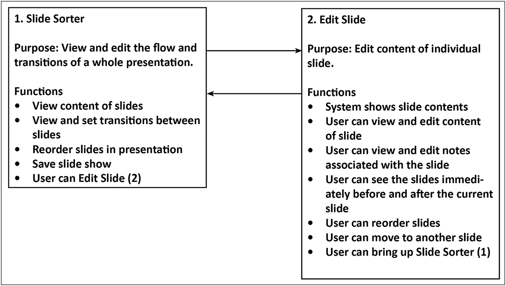
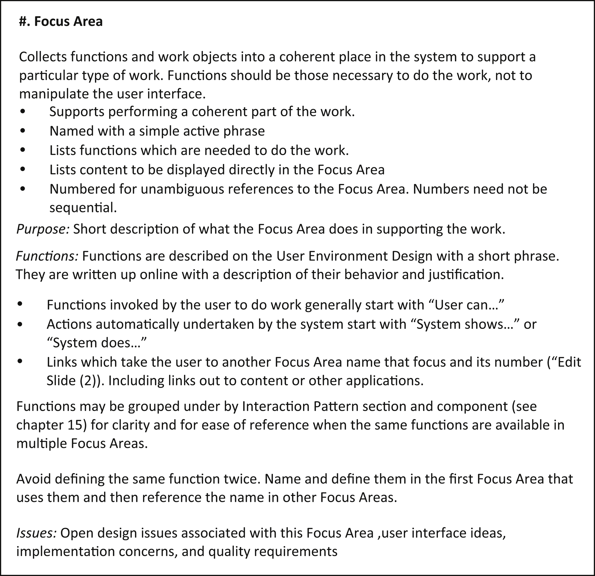
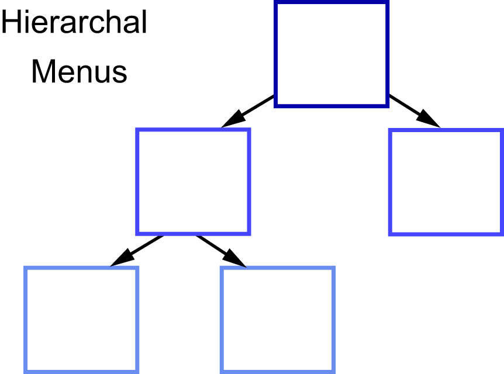
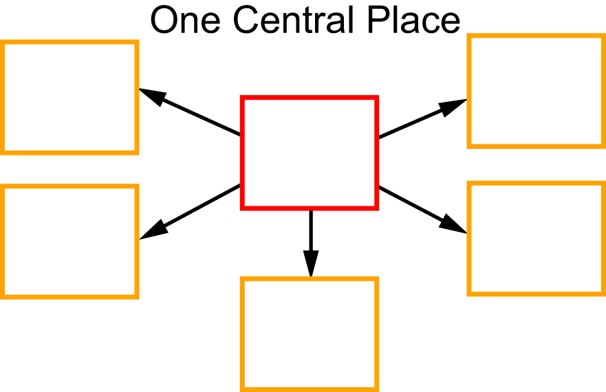
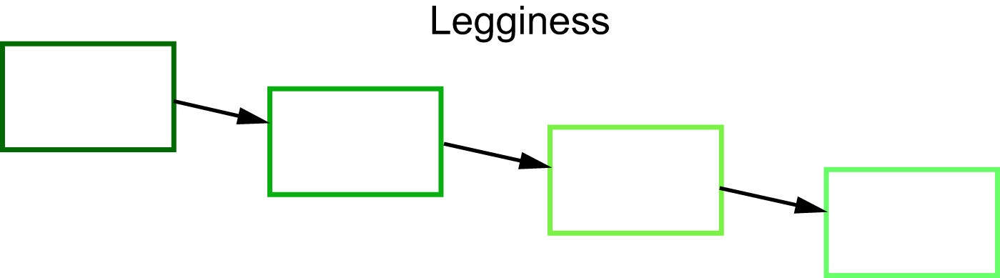

# 14. User Environment Design

A product is defined by the places it provides to support the storyboards, the purpose of each place, the functions and content in each place and the flow between places &mdash; within one product and across devices.

The User Environment Design is a floor plan of the new product showing the places in the product, the function in that place, and the links between one place and another.

It shows the places where user interacts with the product, the function and content within those places, the way information is brought into each place, and the pathways for the user to move between places.

It doesn’t make sense to design screen layouts until you’ve decided what places will be in the system and what functions the system should implement.

In the User Environment Design, places are defined by **Focus Areas**, a core concept for structuring the user experience. Focus areas define a set of function and content all oriented toward achieving a particular purpose or user intent. A user moves from one focus area to another as needed to perform an activity.

These are the challenges of product design:
- create the necessary places on the right platforms to support the flexibility of the activity;
- design the right function into those places; and
- design the right access from place to place so the flow of the user’s work is not interrupted.

## The User Environment Design elements

Every Focus Area has a **purpose**: a succinct statement of the primary intent the Focus Area supports. If you can’t write a single sentence which describes the purpose of the Focus Area, it’s likely that the product is poorly structured, either because there are so many different functions doing different things or because the place supports no coherent activity at all.

- Some functions in a Focus Area are things the underlying system does on behalf of the user: “Show slide content.”
- Some functions can be invoked by the user: “Edit slide content”.
- And other functions are **links**, taking the user to another place in the product: “Bring up Slide Sorter.”

You’d expect to find these links between Focus Areas whenever the user might need to switch between the activities they support.

Back on the “Edit Slide” screenshot, note the list of slides in the pane on the left. This is a **navigation tool**, like the left navigation bars found on web pages. It’s not a separate Focus Area &mdash; no **independent work** is done there. Instead it provides three functions:

- it shows where the current slide lies in the context of the slideshow, helping the user track continuity;
- it lets the user jump to another slide; and
- it lets the user do local reordering of slides via drag and drop right in that pane. 

But reordering slides is the primary purpose of the slide sorter Focus Area. Is this duplication of function wrong or confusing? Should there be only one place to reorder slides?

No. It’s easy to start thinking logically about the design, and logic is never user centered. When a presenter is looking at a slide, it’s natural to think how it flows with the slides before and after &mdash; how this piece of the presentation’s story hangs together. So it’s natural to rethink the ordering, and choose to rearrange slides just for this piece of the presentation. That’s quite **different** from thinking about the overall presentation: the introduction, discussion, and wrap up. Users don’t get confused when function is available in two places &mdash; they get annoyed when the function they want isn’t available in the place they’re in.

The presenter notes at the bottom of PowerPoint’s screen are another interesting case in point. In early versions of PowerPoint, presenter notes were brought up in their own window &mdash; in a separate Focus Area. But it’s common when preparing a presentation to add to the notes while editing a slide. Writing the slide content reminds the presenter of a point they want to make, so they add it to the notes. Or some content won’t fit on the slide, so the presenter decides that they can just talk about that point &mdash; but they copy it to the notes so they don’t forget. So there’s a tight, organic **interaction** between slide and notes. Separating them into different Focus Areas made the work flow cumbersome. Over time, the PowerPoint team recognized the problem and merged the Focus Areas.

In PowerPoint, all the content is supplied by the user. Other products &mdash; a news site presenting stories, a shopping site presenting products, or a booking site presenting flight options &mdash; have **content** of their own which needs to be organized and presented. In such cases, the User Environment Design will list the content the Focus Area provides as well as the function to manipulate it.

## Building the User Environment Design from storyboards

A storyboard presents the users’ actions linearly but a good product will not be linear; your job is to find the implied **places** in the stories and assemble them and the **function** they need into a coherent structure. Then when you encounter the next cooking story, you first ask whether you can reuse a place you already have, maybe adding to or twisting it a bit to accommodate the new story. Need to support the microwaved hot dog in our fancy kitchen? Let’s just add a microwave near the refrigerator.

To build the User Environment Design, review the storyboards one at time, asking what place is needed to support this step of the story and what function and content is needed in that place. Storyboards implicitly define requirements for the User Environment Design; pull these implications out by walking through it cell by cell. Each cell may suggest a new Focus Area, function, content, or link in the emerging User Environment Design. The pictorial nature of storyboards help you recall the context and design implications of each cell far better than a written scenario or description. As you walk each cell, ask whether the user is in a new Focus Area, or whether you can reuse one already in the User Environment Design. Same for functions and links &mdash; has the storyboard added a new function or reused an existing function? If you are extending an existing product, start with a high-level reverse User Environment Design of the product and roll your new function into that to keep the product coherent. Discuss these implications and revise or extend the User Environment Design to capture your decisions.

Each storyboard is woven into the evolving User Environment Design one cell at a time. Since the storyboards were designed individually, they may envision similar or overlapping places in the product. As the team walks through the storyboard, they determine whether a cell is envisioning a new place or can reuse an existing place, extending it as necessary. The process is exactly the same when weaving in the next storyboard &mdash; some places will already exist as Focus Areas in the product, whereas others will be newly defined. The User Environment Design will evolve to support them all.

Resist defining the user interface until you see what is needed in each place in the product.

## Seeing structure: classic errors

**Exposing the database** is still a problem in too many products. (In fact, frameworks such as Ruby on Rails positively encourage putting the database in the user interface.) Instead of understanding the practice and creating a product structure to support it, product designers simply put the data tables and relationships on the screen, one table per Focus Area, requiring the user to learn and traverse the database schema. Users don’t want to understand your database &mdash; they want to focus on their activities. And a hierarchical structure is prone to becoming hallways &mdash; a series of Focus Areas, each of which fulfills no real intent except to get to the next place.

**One Central Place** forces the user back and forth to a central place before going on to the next intent. One Focus Area becomes the central hub, whether or not it supports any real intent or needs to be in the center of the activity. What is the next likely thing a user wants to do after completing a step? Your user data will tell you. Provide function that lets the user get there without interrupting their flow of thought

**Legginess** forces the user to traverse many places to get to the Focus Area they need. Shopping sites that move from category to category are often too leggy. Wizards can lock the user into too many steps—and are often unnecessary with proper design. Or designers, with the best of intentions, use scenario-based design and gave each task step its own Focus Area. Hierarchies can become a set of leggy hallways. Bring what the user needs into the place—don’t drive them through a set of links.

