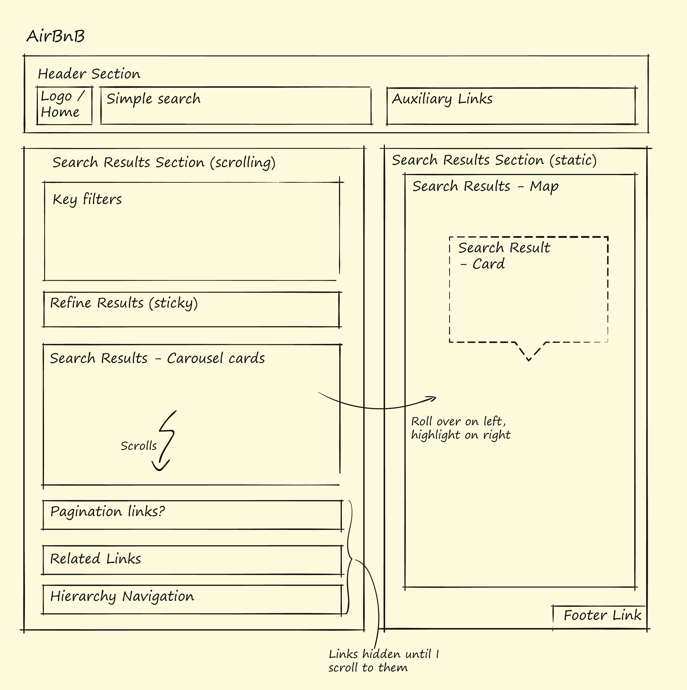
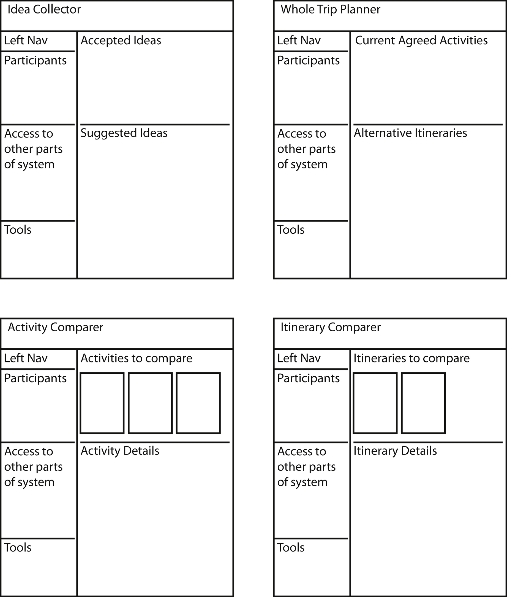

# Interaction Patterns

**Interaction designers**:
- understand how to see the overall product structurally and how to organize function and content coherently in any interface &mdash; whether that be a webpage, desktop or mobile application, watch, fitness device, or any other platform.
- should be exploring potential Interaction Patterns and approaches in parallel &mdash; a kind of exploratory sketching and investigation of new approaches appropriate to the team’s design ideas as they come up.

The focus of an interaction designer is not the visual design or what the interface looks like, it’s how the interface works. Information architects, user researchers, visual designers, and other job types may share this skill, but it is the explicit job of an interaction designer to know the **modern tools, techniques, and current approaches** of their field &mdash; their **materials of design**.

The User Environment Design focuses the team on the overall structure of the product; it defines a set of Focus Areas and the function, content, and links within each place. It identifies utilities used across places and function available in more than one place. But it does not say how users interact with function and content, or what the actual layout of the place might be on a screen.

**Interaction Patterns** define
- the overall layout of a screen,
- where content and functions are accessed on the screen,
- how the flow of an activity traverses a screen, and
- navigation between screens (where a screen might be a webpage, a window, or a panel depending on the platform).

Interaction Patterns give the team a way to think structurally about the design they are creating without getting caught up in lower-level details and the graphical look.

We start by looking for and naming the **components** on the page. A component is a collection of content and controls that fulfills a coherent intent. Every page &mdash; any interface &mdash; is composed of a set of components which support the overarching purpose of the place. In User Environment Design terms, the purpose of this Focus Area is to help people find a place to stay. But to help people see and move through the function and content in the place, interaction designers must structure the place into a set of components. Taken together, these components define the Interaction Pattern of this place.

- Interaction Patterns define the components that deliver function and content.
- Every component supports a coherent intent.
- Some components may be hidden until the user interacts with the screen.
- Components are collected into **Sections** that define the screen structure.

When naming components, try to come up with something that describes the intent, but is generic enough that we could imagine using it in any product.
- Don’t name it something literal, like Travel Filters because that obscures how this might be used in other domains.
- Don’t name it something too ambiguous either, like Search Results Filter, because that hides the intent, which is what makes this component interesting.

|  |
| :---: |
| FIGURE 15.6 Airbnb’s Interaction Pattern showing sections and components. |

In most applications and certainly in most web pages, there are *standard sections* that appear frequently. They are sections that have become almost universal, such as a **Header** or a **Footer** section. In cases like this, it’s fine to just give it the name that everyone recognizes. Trying to name it something else will only cause confusion.

When you have defined Interaction Patterns for every Focus Area and ensured that any Focus Area with the same intent uses the same pattern, you will have defined your user interface architecture. This will guide your choices for any new Focus Area that might be added to the product &mdash; simply reuse the appropriate screen pattern, section, or components. Fig. 15.7 shows an example of a set of patterns working together for a whole product.

|  |
| :---: |
| FIGURE 15.7 A set of Interaction Patterns that work together in a product to support a high-level user intent. |

## Innovation and interaction patterns

Designers can change their Interaction Patterns to increase the cool factors defined by the Triangle of Joy in Use: Direct-into-Action, the Hassle Factor, and the Learning Delta. (The cool factors of Accomplishment, Connection, and Identity should have already been dealt with during ideation and storyboarding. Sensation for most products is part of visual design.) With function and content defined, the interaction design focuses on the overall principles of good design, augmented by principles from the Triangle of Joy in Use.

Innovation rarely starts from nothing; innovation is mostly the recombination of known parts, adapting them to deliver new, desirable experiences. This is the space where interaction design innovation lives.

- Steal ideas from consumer products or whatever is the talk of the town
- Borrow the best Interaction Patterns in use for standard interactions
- Innovation is the recombination of known parts with the right twist for your product

Over the years the manifestation of place in products has changed. Once it was a hardly noticeable command line, then it was a green screen form, next a WISYWIG interface, then a window with dialogue boxes. Now a place is a webpage, a screen on phones, tablets, and watches, or a display on a kiosk. [...] Whatever the realization of a place is, the Interaction Pattern will be needed to help designers think about how to design that place structurally.

So what makes for a good place structure? It has to
- work for the activities of the user, but also 
- address the Cool Concepts and
- fit modern user interface standards of the moment.

All the products in a user’s life set their expectation for how products are structured and how they will behave.

## Building interaction patterns from the user environment design

The User Environment Design collects all the product requirements from all of the storyboards and organized them into coherent areas, each focused on its core intent. Now it’s up to the interaction designer to figure out creative ways of making the function and content available in one coherent place in the interface.

- To start, the team looks across the User Environment Design to identify the types of places they need Interaction Patterns for.
- Once they agree and design the Interaction Patterns, they can map function and content into them. These patterns are a hypothesis &mdash; they will adapt as more function and content are rolled in from the different Focus Areas.
- The initial Interaction Pattern set will be reexamined and normalized after initial design and then again after it is tested with users in the validation pass.
- Eventually a full set of Interaction Patterns will be specified for the whole product.

The purpose, functions, and content defined by each Focus Area provide the requirements for the Interaction Pattern: it needs to provide a place for each function, making it ready to hand when needed and only when needed, in a structure that allows for easy scanning, access to content, and clear interaction.

Interaction Patterns act as a framework for designers, focusing them on the structure of the page and the structure of the product from a user interface perspective. The patterns help the team think structurally about the user interface, which moves them away from thinking only about functions or look of the page. Pushing the team to think structurally ensures greater consistency within and across the product. And by starting the team with analysis of existing products, the team is encouraged to use modern design approaches and principles while they are reinventing the practice.

| Use Interface Design Principles
| ---
| User environment design
| 1. Purpose/intent of the place is clear
| 2. Purpose/intent of each component in the relevant Interaction Pattern is clear
| 3. Everything you need to achieve the intent is in the place--and nothing more
| 4. Navigation to the next reasonable action is apparent and in the place
| 5. Needed content is instantly available and in the right chunks for quick consumption; the next needed content is clearly available
| User interface
| 6. Prominence: Most important elements to the intent take the most space/central to the eye
| 7. Relationship: Page elements are visually related to one another to achieve the overall intent
| 8. Visual Flow: The eye has a clear starting place and path to follow that supports the intent
| 9. Interaction Flow: Moving from one step of a task to the next is obvious and easy
| 10. Clarity: It’s apparent what can be done and how to do it, and the results are clear
| 11. Simplicity: There’s one place to achieve each intent; there’s no unnecessary complexity on the screen
| Cool
| 12. Direct Into Action: immediate and actionable support for actions, decision-making, and instant results
| 13. Hassle is reduced at every level
| 14. No learning is needed to interact with the product
| 15. Sensation and animation are used sparingly to complement functionality or bring a smile without distraction
| 16. Modern Interaction Patterns are used everywhere

