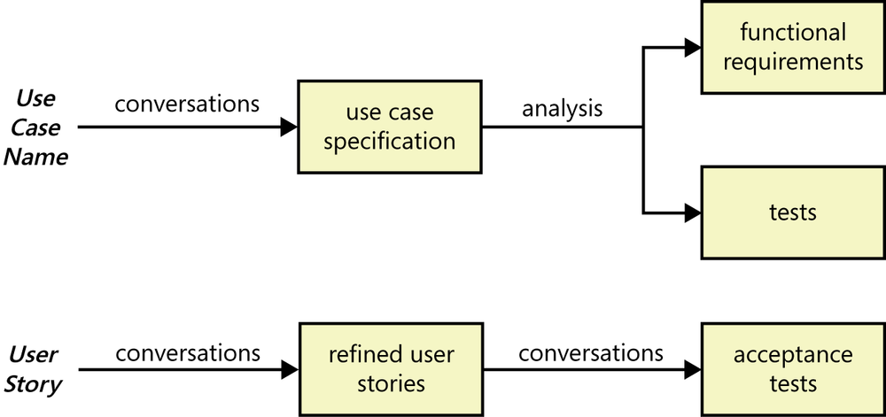
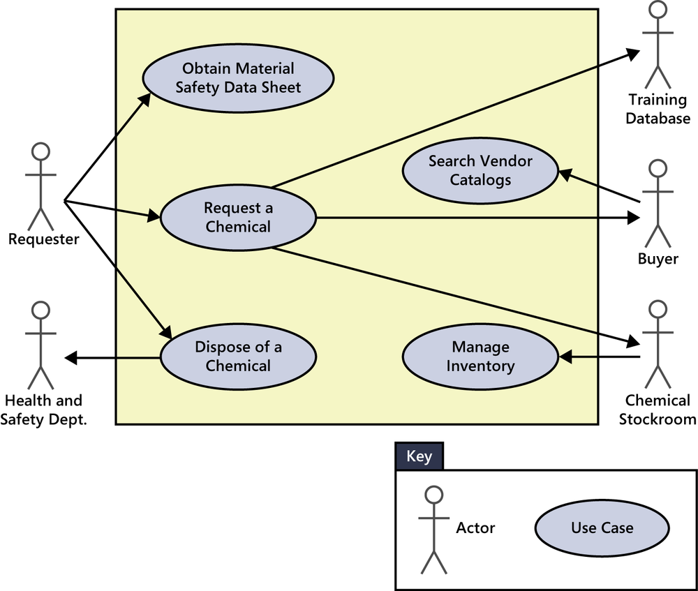
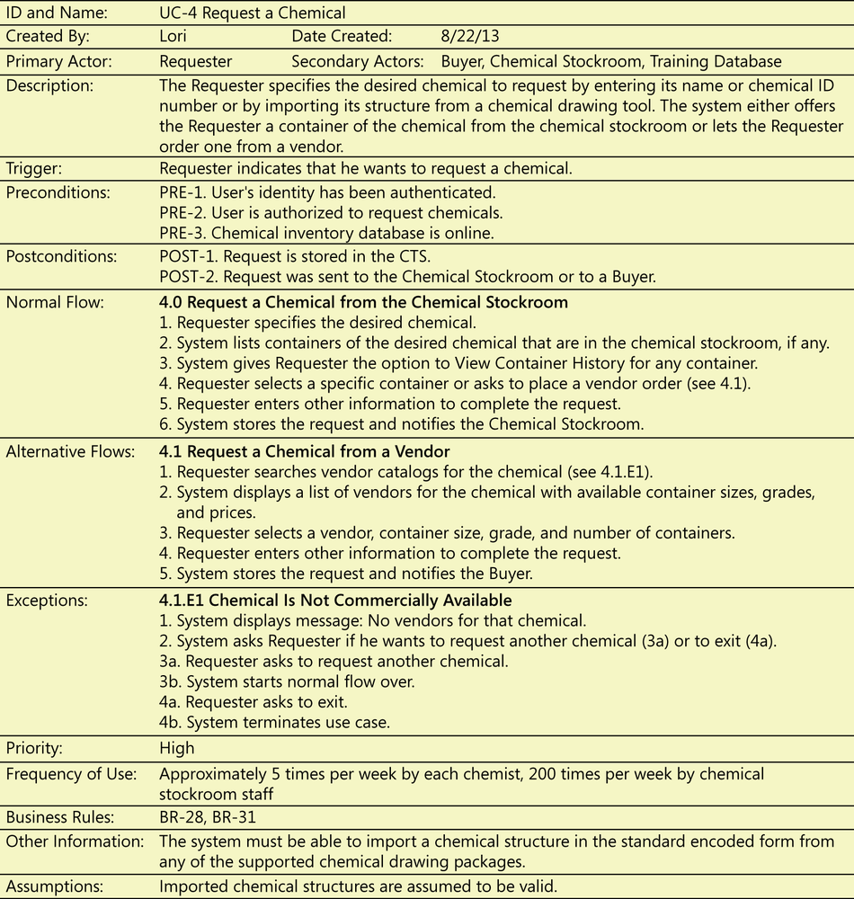

# 8. Understanding user requirements

## Use cases and user stories

A **use case** describes a sequence of interactions between a system and an external actor that results in the actor being able to achieve some outcome of value.

A **user story** is a short, simple description of a feature told from the perspective of the person who desires the new capability, usually a user or customer of the system. User stories often are written according to the following template, although other styles also are used:

```
As a <type of user>, I want <some goal> so that <some reason>.
```

| Application | Sample use case | Corresponding user story
| ----------- | --------------- | ------------------------
| Chemical tracking system | Request a Chemical | As a chemist, I want to request a chemical so that I can perform experiments.
| Airport check-in kiosk | Check in for a Flight | As a traveler, I want to check in for a flight so that I can fly to my destination.
| Accounting system | Create an Invoice | As a small business owner, I want to create an invoice so that I can bill a customer.
| Online bookstore | Update Customer Profile | As a customer, I want to update my customer profile so that future purchases are billed to a new credit card number.

|  |
|:--:|
| Figure 8-1. How user requirements lead to functional requirements and tests with the use case approach and the user story approach. |

Rather than specifying functional requirements, agile teams typically elaborate a refined user story into a set of acceptance tests that collectively describe the story’s “conditions of satisfaction.” [...] If the developer implements the necessary code to satisfy the acceptance tests &mdash; and hence to meet conditions of satisfaction &mdash; the user story is considered to be correctly implemented.

Not everyone is convinced that user stories are an adequate requirements solution for large or more demanding projects. You can examine each element of a use case (flows, preconditions, postconditions, and so on) to look for pertinent functional and nonfunctional requirements and to derive tests.

## The use case approach

**Use case diagrams** provide a high-level visual representation of the user requirements.

The arrows in a use case diagram simply indicate the connections between actors and use cases in which they participate; they do not represent a flow of any kind.

|  |
|:--:|
| Figure 8-2. Partial use case diagram for the Chemical Tracking System. |

## Use cases and usage scenarios

A use case describes a discrete, standalone activity that an actor can perform to achieve some outcome of value. A use case might encompass a number of related activities having a common goal. A **scenario** is a description of a single instance of usage of the system. A use case is therefore a collection of related usage scenarios, and a scenario is a specific instance of a use case.

|  |
|:--:|
| Figure 8-3. Partial specification of the Chemical Tracking System’s “Request a Chemical” use case. |

### Preconditions and postconditions

**Preconditions** define prerequisites that must be met before the system can begin executing the use case. The system should be able to test all preconditions to see if it’s possible to proceed with the use case.

**Postconditions** describe the state of the system after the use case executed successfully. Postconditions can describe:

- Something observable to the user (the system displayed an account balance).
- Physical outcomes (the ATM has dispensed money and printed a receipt).
- Internal system state changes (the account has been debited by the amount of a cash withdrawal, plus any transaction fees).

### Normal flows, alternative flows, and exceptions

One scenario is identified as the **normal flow** of events for the use case. It’s also called the main flow, basic flow, normal course, primary scenario, main success scenario, sunny-day scenario, and happy path.

Other success scenarios within the use case are called **alternative flows** or **secondary scenarios**. Alternative flows deliver the same business outcome (sometimes with variations) as the normal flow but represent less common or lower-priority variations in the specifics of the task or how it is accomplished. The normal flow can branch off into an alternative flow at some decision point in the dialog sequence; it might (or might not) rejoin the normal flow later. The steps in the normal flow indicate where the user can branch into an alternative flow. A user who says, “The default should be…” is describing the normal flow of the use case. A statement such as “The user should also be able to request a chemical from a vendor” suggests an alternative flow, shown as 4.1 in Figure 8-3, which branches from step 4 in the normal flow.

Recall that user stories are concise statements of user needs, in contrast to the richer description that a use case provides.

- As a chemist, I want to request a chemical so that I can perform experiments.
- As a chemist, I want to request a chemical from the Chemical Stockroom so that I can use it immediately.
- As a chemist, I want to request a chemical from a vendor because I don’t trust the purity of any of the samples available in the Chemical Stockroom.

The first of these three stories corresponds to the use case as a whole. The second and third user stories represent the normal flow of the use case and the first alternative flow.

Conditions that have the potential to prevent a use case from succeeding are called **exceptions**. Exceptions describe anticipated error conditions that could occur during execution of the use case and how they are to be handled. In some cases, the user can recover from an exception, perhaps by re-entering some data that was incorrect. In other situations, though, the use case must terminate without reaching its success conditions.

### Extend and include

Figure 8-3 showed that the normal flow for the “Request a Chemical” use case is to request a chemical from the Chemical Stockroom; an alternative flow is to request a chemical from a vendor. In the use case diagram in Figure 8-2, the Buyer has a use case called “Search Vendor Catalogs.” Suppose you wanted to let the Requester execute that same “Search Vendor Catalog” use case as an option when requesting a chemical, as part of the alternative flow processing. A use case diagram can show that a standalone use case like “Search Vendor Catalogs” extends the normal flow into an alternative flow, as illustrated in Figure 8-5.

| ![Fig.8-35(./fig08-05.png) |
|:--:|
| Figure 8-5. An example of the use case extend relationship for the Chemical Tracking System. |

